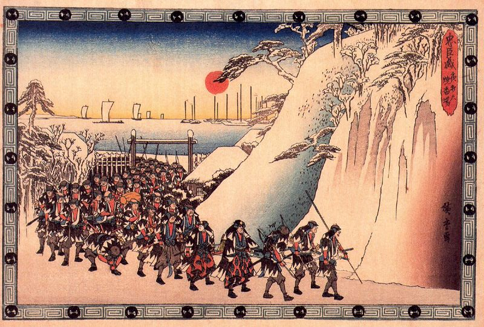
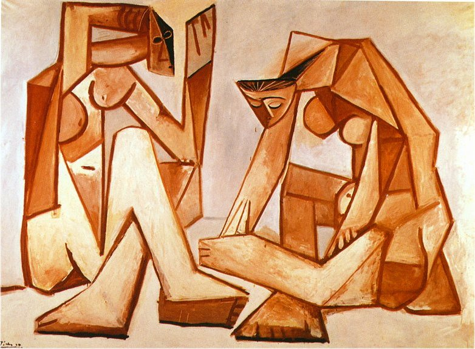
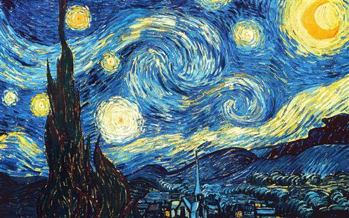

# Neural Art Connoisseur

Apllying convolutional neural networks to predicting the most probable art styles of a given painting.

## Contents

- **[How to use](#how-to-use)**
- **[The dataset and data pre-processing](#the-dataset-and-data-pre-processing)**
- **[The neural network and fine tuning process](#the-neural-network-and-fine-tuning-process)**
- **[Unusual practices](#unusual-practices)**

## How to use
 
First of all, please certify that you have **Tensorflow** and **Pillow(PIL)**, if you do not, please run the following :

 `pip install --upgrade tensorflow==2.0.0-rc1`
 
 `pip install Pillow`

After that, paste the images you want the neural network to predict in the **images_to_predict** folder.

Finally, run **main.py**. The system will print, for each painting given, the 3 most probable art styles.

 `python3 main.py`

>the_scream.jpg
>  
>>Most likely:  Expressionism
>>
>>Second prediction:  Abstract
>> 
>> Third prediction:  Post_Impressionism

The *images_to_predict* folder already has some example images loaded in it to certify everything is working correctly.

**Disclaimer: The neural net won't accept .png files due to them having 4 channels instead of the usual 3 rbg channels.**
## The dataset and data pre-processing
The used dataset was a older version of the wikiart dataset which can be found [here](https://www.wikiart.org/en/paintings-by-genre).

The dataset was then narrowed to 17 art styles, being them:

- Minimalism
- Romanticism 
- Rococo 
- Post Impressionism 
- Art Nouveau Modern
- Renaissance
- Pointillism
- Realism
- Ukiyo-e
- Symbolism
- Baroque
- Cubism
- Abstract
- Pop Art
- Expressionism
- Color Field Painting

Here are some example paintings from some of the art styles:

**Ukyo-e**

**Cubism** 

**Post-impressionism**

Since this dataset was very unbalanced there were implemented two measures to decrease it's effects. 

*Firstly*, I only loaded a maximum of **3500** images from each class.

**However** there still were some classes which didn't even have 3500 images, so *secondly*, using sklearn, I computed the ***class weight dict*** for each of the classes, which was then fed as a parameter to the **keras.fit()** method.

The option of using **[SMOTE](http://rikunert.com/SMOTE_explained)** was put on the table, but upon reflecting on the computacional complexity of using SMOTE on 180x180x3 images, that option was discarded.

The dataset was then stored in numpy arrays, using the functions in the **data_preprocessing** script. These arrays are not present in the current directory due to their overwhelming size.
## The neural network and fine tuning process

The neural used in this project was a **[VGG16](https://neurohive.io/en/popular-networks/vgg16/)**, a 16-layer convolutional neural network.

This neural network was loaded using **keras.applications**. This way, the neural net was loaded with pre-trained weights from training on the **ImageNet dataset**.

It was then apllied the *fine tuning* technique. All the convolutional layers except for the last block were **frozen**, this means that those layers' weights were no longer trainable, being the only trainable layers the last convolutional block and the dense layers in the end of the net. 

This method combines **feature extraction** and **transfer leaning** with being able to train some of the layers, for a better accuracy.

All the training process is better explained in the **model.py** file.

## Unusual practices

Wherever you may read about neural networks and how to structure the layers, you'll read that for a multiclass, single-label problem, you should use the **softmax** activation function. 

**However**, the catch is that softmax interprets each one of the classes as being totally exclusive and not having anything in common with the others, which, when talking about art styles is not a very good approach. 

To improve the neural net performance, the chosen activation function was **Sigmoid** instead, which is used in multilabel problems, because art styles and artist are often influenced by others.

